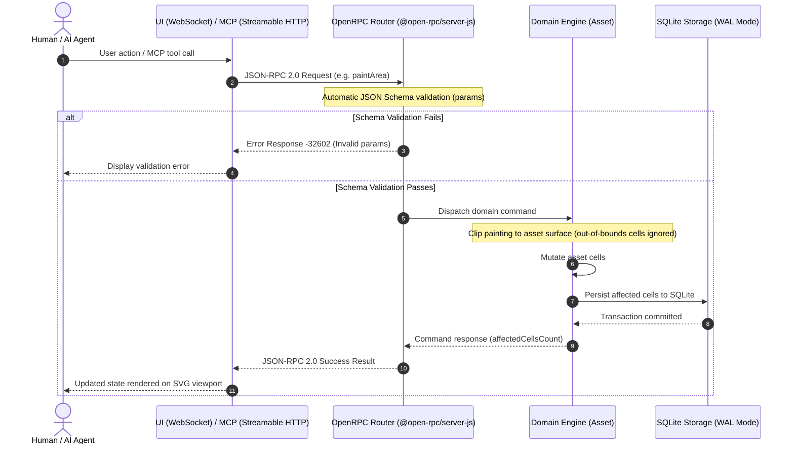

# End-to-End Data Flows

This document details the sequence and boundaries of data flows across the system layers.

---

## 1. End-to-End Flow: UI / MCP -> OpenRPC -> Domain -> SQLite

```mermaid
sequenceDiagram
  autonumber
  actor User as Human / AI Agent
  participant Adapter as UI (WebSocket) / MCP (Streamable HTTP)
  participant Router as OpenRPC Router (@open-rpc/server-js)
  participant Domain as Domain Engine (Asset)
  participant Store as SQLite Storage (WAL Mode)

  User->>Adapter: User action / MCP tool call
  Adapter->>Router: JSON-RPC 2.0 Request (e.g. paintArea)
  Note over Router: Automatic JSON Schema validation (params)
  alt Schema Validation Fails
    Router-->>Adapter: Error Response -32602 (Invalid params)
    Adapter-->>User: Display validation error
  else Schema Validation Passes
    Router->>Domain: Dispatch domain command
    Note over Domain: Clip painting to asset surface (out-of-bounds cells ignored)
    Domain->>Domain: Mutate asset cells
    Domain->>Store: Persist affected cells to SQLite
    Store-->>Domain: Transaction committed
    Domain-->>Router: Command response (affectedCellsCount)
    Router-->>Adapter: JSON-RPC 2.0 Success Result
    Adapter-->>User: Updated state rendered on SVG viewport
  end
```
